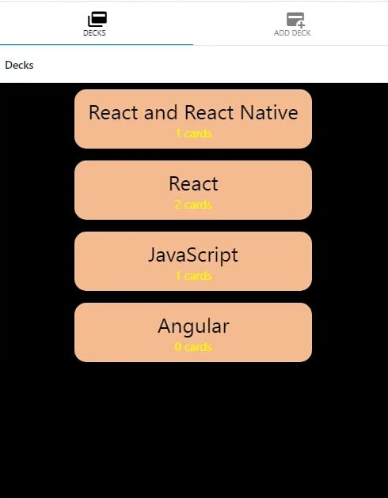
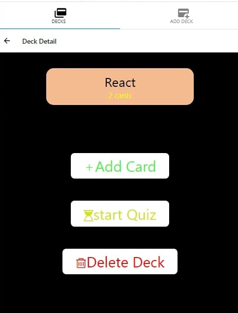
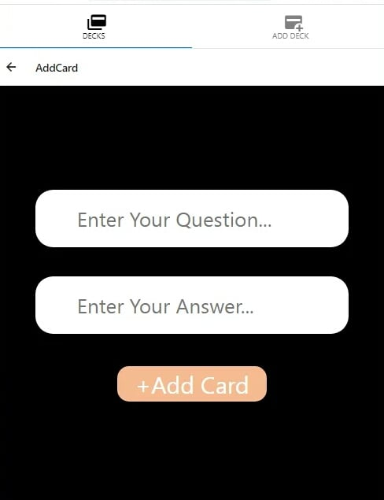
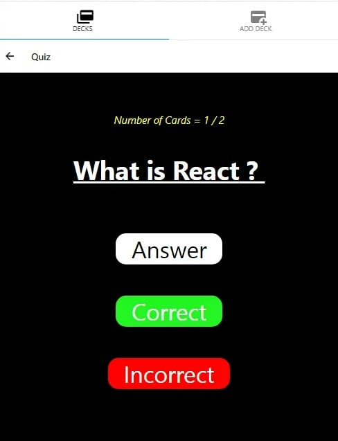
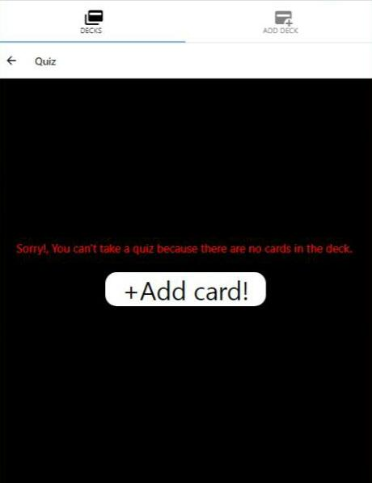
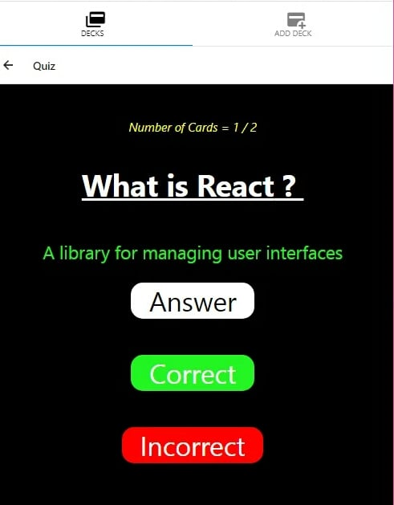
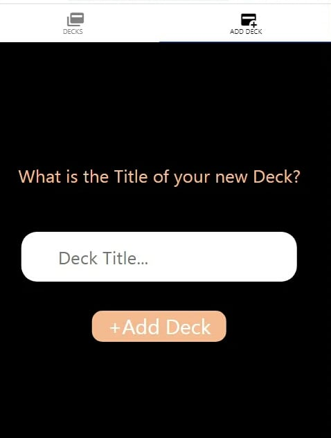

# Mobile Flashcards

### Table of contents:
 - [Overview](#overview)
 - [Project Functionalities](#project-functionalities)
 - [How To Run ](#how-to-run )
 - [Screenshots](#screenshots)
 - [Copyright and License](#copyright-and-license)
  

#### Overview
-  Mobile Flashcards is a mobile application (Android or iOS - or both) that allows users to study collections of flashcards. The app will allow users to create different categories of flashcards called "decks", add flashcards to those decks, then take quizzes on those decks.
-  Built using (*React Native*, *React*, *Redux*, *Expo*, *expo/create-react-native-app*). 

#### Project Functionalities
* Allow users to create a deck which can hold an unlimited number of cards.
* Allow users to add a card to a selected deck.
* Each deck view have options to **Add a new card** /**start quiz** / **Delete deck**.
* Each single card should display the question.
* Users should be able to quiz themselves on a specific deck and receive a score once they're done.
* Users should receive a notification to remind themselves to study if they haven't already for that day.

#### How To Run 
* Install dependencies `npm install`

* Start dev server `expo start` or `npm start`
  
  

#### Screenshots
Empty Deck List

Deck List

Deck Detail

Add card

Quiz question

Quiz question For empty Deck

Quiz answered question

Result

Add New Deck

#### Copyright and License
- supplied without rights.

